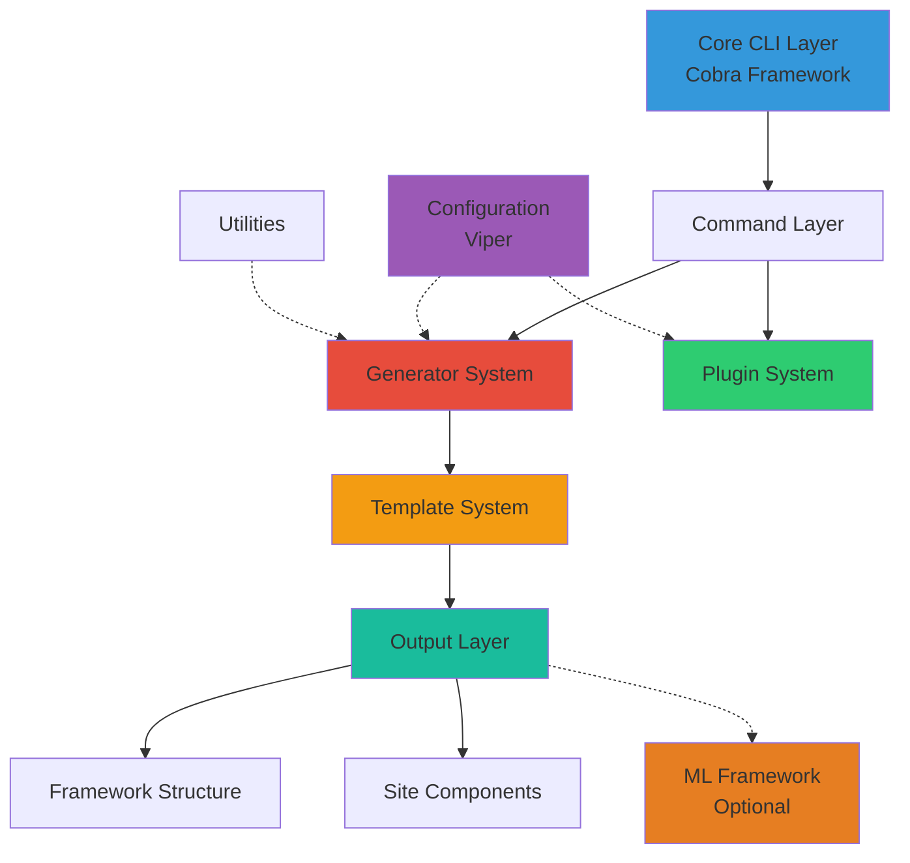
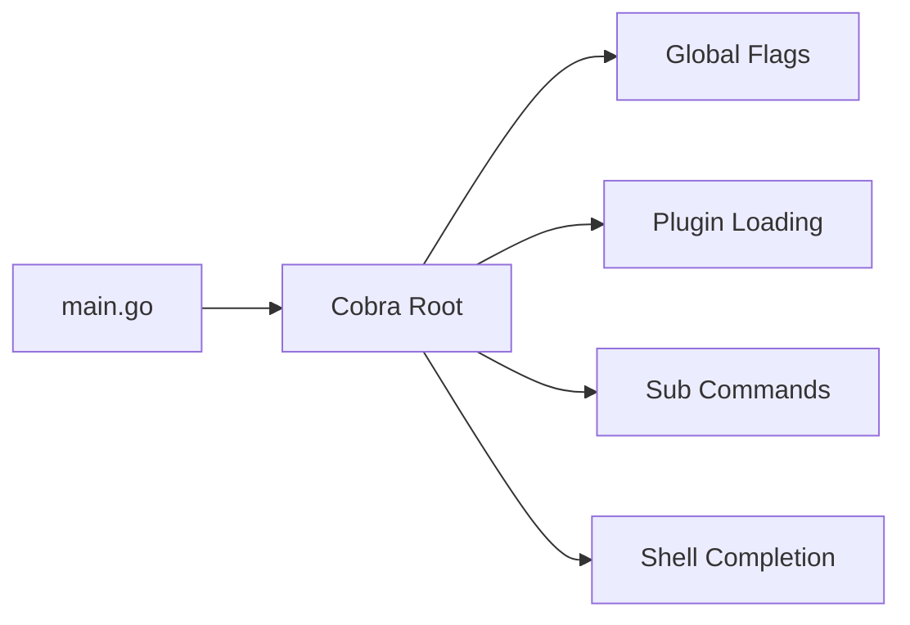
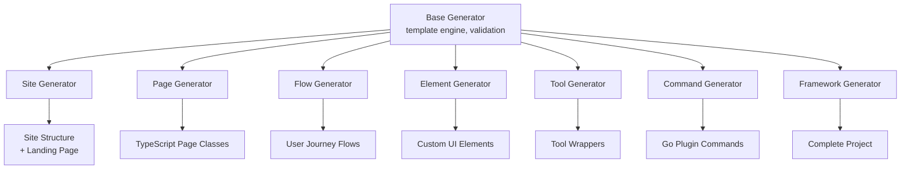
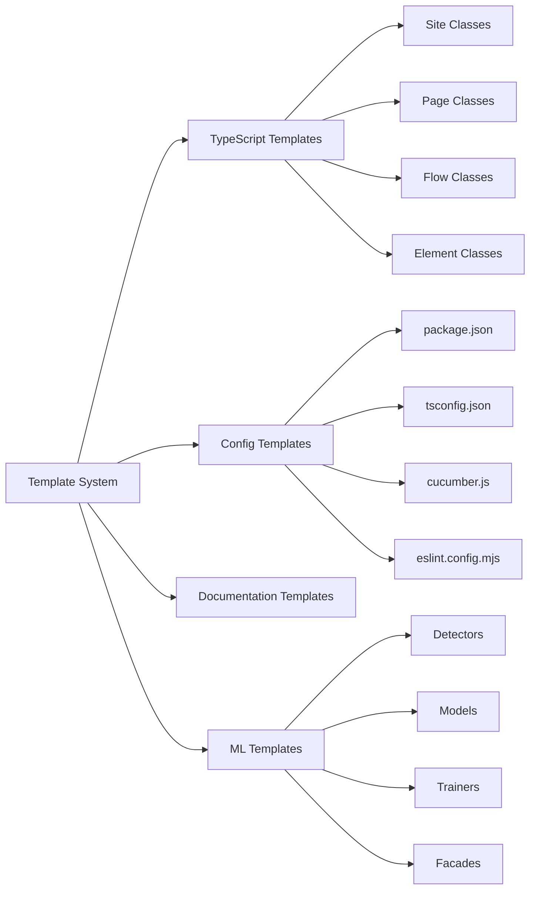
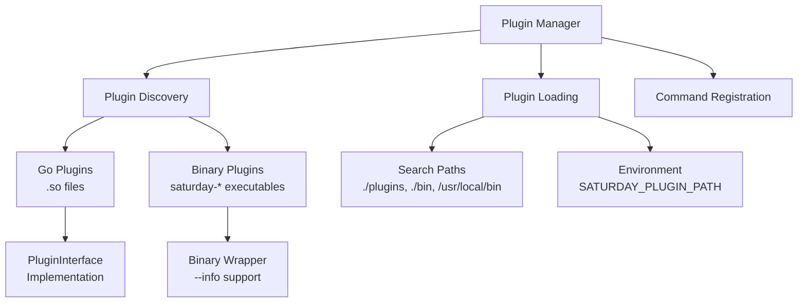
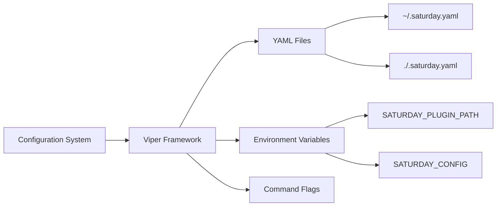
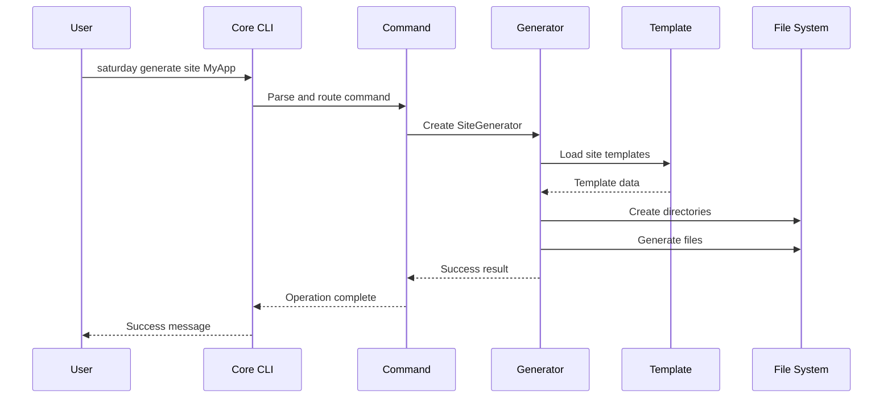
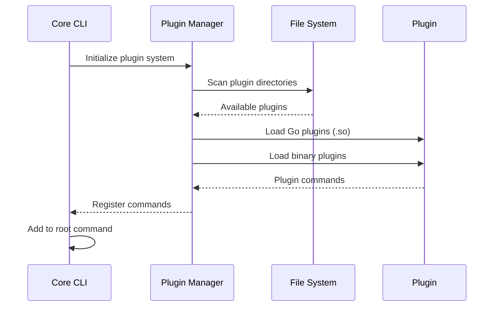

# Saturday CLI - Architecture Overview

## System Architecture

Saturday CLI is built with a modular, extensible architecture that follows Docker/Kubernetes-style design patterns. The system is composed of several key layers that work together to provide comprehensive test framework generation capabilities.

## High-Level Architecture



## Core System Components

### 1. Core CLI Layer (Foundation)

**Location**: `cmd/saturday/main.go`

The foundation layer built on the Cobra framework provides:

- **Command Parsing**: Root command with global flags (`--config`, `--verbose`, `--dry-run`)
- **Plugin Discovery**: Automatic loading of Go and binary plugins on startup
- **Error Handling**: Comprehensive error reporting with helpful suggestions
- **Shell Completion**: Support for bash, zsh, and fish shells
- **Version Management**: Git-based version info with commit and build date



### 2. Command Layer

**Location**: `internal/commands/`

The command layer implements the main CLI operations:

#### Generate Commands (`generate.go`)
```bash
saturday generate framework [NAME] --with-ml --with-examples
saturday generate site [SITE_NAME] --base-url URL --with-ml
saturday generate page [PAGE_NAME] --site SITE --path PATH
saturday generate flow [FLOW_NAME] --site SITE --pages "PAGE1,PAGE2"
saturday generate element [ELEMENT_NAME] --base-type TYPE
saturday generate tool [TOOL_NAME] --type TYPE
saturday generate command [COMMAND_NAME] --cobra
```

#### Init Commands (`init.go`)
```bash
saturday init project [NAME]     # Complete project initialization
saturday init config             # Configuration file creation
```

#### Plugin Commands (`plugin.go`)
```bash
saturday plugin list             # List installed plugins
saturday plugin install URL     # Install new plugins
saturday plugin info NAME       # Plugin details
```

### 3. Generator System

**Location**: `internal/generator/`

The generator system is the heart of the CLI, responsible for creating all TypeScript/Playwright components:



#### Generator Hierarchy

**Base Generator** (`base_generator.go`)
- Template engine with Go templates
- File and directory creation utilities
- Validation and error handling
- Progress reporting and dry-run support

**Specialized Generators**:

1. **Framework Generator**: Creates complete project structure
2. **Site Generator**: Generates site-specific directory structure and base classes
3. **Page Generator**: Creates page object classes with element registration
4. **Flow Generator**: Generates user journey flow classes
5. **Element Generator**: Custom UI element classes extending base elements
6. **Tool Generator**: External tool integration wrappers
7. **Command Generator**: Go plugin command scaffolding

### 4. Template System

**Location**: `internal/templates/`

The template system provides flexible, customizable code generation:



#### Template Features

- **Go Template Engine**: With custom helper functions
- **Helper Functions**: `toPascalCase`, `toCamelCase`, `toKebabCase`, etc.
- **Conditional Sections**: ML components, examples, factories
- **Template Inheritance**: Base templates with specializations
- **Validation**: Template syntax and data validation

#### Template Categories

1. **TypeScript Templates**: Complete Playwright framework classes
2. **Configuration Templates**: Node.js and build configuration files
3. **Documentation Templates**: README files and API documentation
4. **ML Templates**: Optional machine learning framework integration

### 5. Plugin System

**Location**: `internal/plugin/`

Saturday supports two types of plugins for maximum flexibility:



#### Plugin Types

**Go Plugins** (Shared Libraries):
- Hot-loadable `.so` files
- Implement `PluginInterface`
- Full access to Saturday internals
- Type-safe integration

**Binary Plugins** (Standalone Executables):
- Independent executables named `saturday-PLUGIN_NAME`
- Cross-platform compatibility
- No Go dependency
- Support `--info` flag for metadata

#### Plugin Discovery

Plugins are automatically discovered from:
- `./plugins/` (local development)
- `./bin/` (project binaries)
- `/usr/local/bin/` (system-wide installation)
- `$SATURDAY_PLUGIN_PATH` (environment variable)
- Custom paths from configuration

### 6. Configuration System

**Location**: `internal/config/`

Configuration management using Viper for hierarchical settings:



#### Configuration Hierarchy

1. **Command-line flags** (highest priority)
2. **Environment variables**
3. **Local project configuration** (`.saturday.yaml`)
4. **Global user configuration** (`~/.saturday.yaml`)
5. **Built-in defaults** (lowest priority)

#### Configuration Sections

```yaml
generator:
  author: ""
  license: "MIT"
  defaults:
    ml: true
    examples: true
    factories: true

plugin:
  paths:
    - ./plugins
    - ./bin
    - /usr/local/bin

output:
  verbose: false
  colors: true

ml:
  modelsPath: "./ml-models"
  dataPath: "./training-data"
  logsPath: "./logs"
  reportsPath: "./reports"
```

### 7. Utilities

**Location**: `internal/utils/`

Common utilities supporting all system components:

- **File Operations**: Directory creation, file writing, existence checks
- **String Utilities**: Case conversion, validation, sanitization
- **Validation**: Input validation, identifier checking, dependency verification

## Output Layer

### Generated Framework Structure

Saturday generates a complete, production-ready Playwright test framework:

```
project-name/
├── features/                    # Cucumber BDD features
│   ├── hooks/playwright/        # Playwright integration
│   │   ├── browser-options.ts
│   │   ├── hooks.ts
│   │   └── setup-playwright.ts
│   ├── playwright/
│   │   └── console-logger.ts
│   ├── snippets/               # TypeScript snippets
│   │   ├── README.md
│   │   └── ts-snippets-syntax.js
│   ├── world/                  # Test context
│   │   ├── custom-world.ts
│   │   └── custom-world-options.ts
│   └── step_definitions/       # Step implementations
├── lib/
│   ├── framework/              # Core framework
│   │   ├── base/              # Base classes
│   │   │   ├── base-element.ts
│   │   │   ├── base-filter.ts
│   │   │   ├── base-flow.ts
│   │   │   ├── base-page.ts
│   │   │   └── base-site.ts
│   │   ├── elements/          # UI elements
│   │   │   ├── button.ts
│   │   │   ├── input.ts
│   │   │   └── link.ts
│   │   └── ml/               # ML framework (optional)
│   │       ├── base/         # ML base classes
│   │       ├── detectors/    # Anomaly detection
│   │       ├── models/       # ML models
│   │       ├── trainers/     # Model training
│   │       ├── facades/      # ML facades
│   │       └── types/        # ML types
│   ├── sites/                # Site implementations
│   └── tools/                # Tool integrations
├── reports/                  # Test reports
├── package.json             # Node.js dependencies
├── tsconfig.json           # TypeScript configuration
├── cucumber.js             # Cucumber configuration
├── eslint.config.mjs       # ESLint configuration
└── README.md               # Documentation
```

### Site Component Structure

For each generated site:

```
lib/sites/SITE_NAME/
├── SITE_NAME.ts             # Main site class
├── factories/               # Test data factories
├── filters/                 # Page filters
├── flows/                   # User flows
├── hooks/                   # Site-specific hooks
├── pages/                   # Page objects
│   └── landing.page.ts     # Default landing page
├── models/                  # Data models
└── interfaces/             # TypeScript interfaces
```

## ML Framework Integration (Optional)

When ML features are enabled, Saturday includes a comprehensive machine learning framework for visual validation:

```mermaid
graph TB
    DETECTORS[Detectors] --> ANOMALY[Anomaly Detector]
    DETECTORS --> REGRESSION[Regression Detector]
    DETECTORS --> LAYOUT[Layout Detector]
    DETECTORS --> ELEMENT[Element Detector]
    
    MODELS[Models] --> VISUAL[Visual Model]
    MODELS --> ANOM_MODEL[Anomaly Model]
    MODELS --> REG_MODEL[Regression Model]
    
    TRAINERS[Trainers] --> SCREENSHOT[Screenshot Trainer]
    TRAINERS --> ELEM_TRAIN[Element Trainer]
    TRAINERS --> PAGE_TRAIN[Page Trainer]
    TRAINERS --> FLOW_TRAIN[Flow Trainer]
    
    FACADES[Facades] --> DET_FACADE[Detectors Facade]
    FACADES --> MOD_FACADE[Models Facade]
    FACADES --> TRAIN_FACADE[Trainers Facade]
```



### ML Components

1. **Detectors**: Visual anomaly and regression detection
2. **Models**: Machine learning model implementations
3. **Trainers**: Model training and data collection
4. **Facades**: High-level ML operation interfaces
5. **Utils**: Image processing and data management

## Data Flow

### Command Execution Flow



### Plugin Loading Flow



## Extension Points

### 1. Custom Generators

New generators can be added by:
- Implementing the `Generator` interface
- Adding command registration
- Creating associated templates

### 2. Template Customization

Templates can be customized through:
- User-defined template directories
- Template override mechanisms
- Custom helper functions

### 3. Plugin Development

Two plugin development paths:

**Go Plugins**:
```go
type PluginInterface interface {
    Name() string
    Description() string
    Version() string
    Command() *cobra.Command
}
```

**Binary Plugins**:
- Executable named `saturday-PLUGIN_NAME`
- Support `--info` flag
- Standard I/O integration

### 4. Configuration Extension

Configuration can be extended with:
- Custom configuration sections
- Environment variable mappings
- Site-specific configurations

## Performance Characteristics

### Generation Performance

- **Framework generation**: < 5 seconds
- **Site generation**: < 2 seconds
- **Page/Flow generation**: < 1 second
- **Template rendering**: < 500ms

### Memory Usage

- **Base CLI**: ~10MB
- **With plugins loaded**: ~25MB
- **During generation**: ~50MB peak

### Plugin Loading

- **Go plugin loading**: < 100ms per plugin
- **Binary plugin discovery**: < 50ms per plugin
- **Command registration**: < 10ms per plugin

## Security Considerations

### Plugin Security

1. **Plugin Validation**: Signature verification (planned)
2. **Sandboxing**: Limited file system access
3. **Permission Model**: Role-based plugin permissions

### Code Generation Security

1. **Input Sanitization**: All user inputs validated
2. **Path Traversal Prevention**: Restricted file operations
3. **Template Injection Protection**: Safe template execution
4. **File Permissions**: Appropriate permissions on generated files

## Build and Distribution

### Cross-Platform Support

Saturday builds for multiple platforms:
- Linux (amd64, arm64)
- macOS (amd64, arm64)
- Windows (amd64)

### Distribution Channels

1. **GitHub Releases**: Pre-built binaries
2. **Go Install**: `go install github.com/yourorg/saturday/cmd/saturday@latest`
3. **Docker Images**: Containerized execution
4. **Package Managers**: Future homebrew, apt, etc.

### Build System

Comprehensive build automation with:
- **Makefile**: All build targets
- **GitHub Actions**: CI/CD pipeline
- **Docker**: Multi-stage container builds
- **Release Automation**: Automated binary packaging

This architecture provides a robust, scalable foundation for a sophisticated CLI tool that can generate complex test automation frameworks while remaining extensible and maintainable.